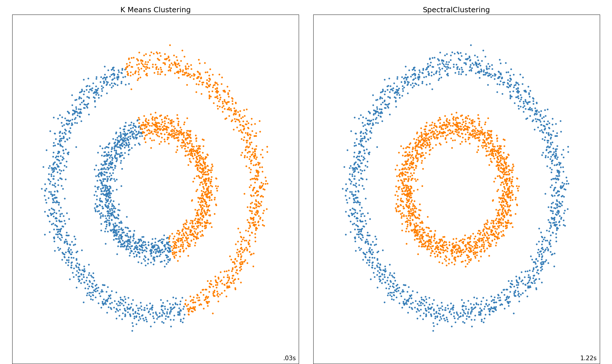

[](http://quantlet.de/)

## [](http://quantlet.de/) **SC_KMeansVsSC** [](http://quantlet.de/)

```yaml

Name of QuantLet : 'SC_KMeansVsSC'

Published in : 'Metis' 

Description : 'This code is modified and simpler version of original code available on scikit learn python library. The codes creates a dataset of noisy circles and performs clustering using K-means and SC'

Keywords : 'Graph theory, spectral clustering, clustering, plot, animation, laplacian, graph, eigenvalues, K means, noisy circles, scikit learn'

Author : 'Kainat Khowaja'
```


